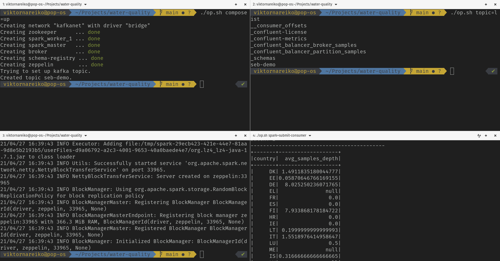
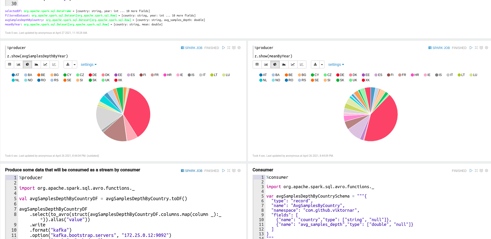
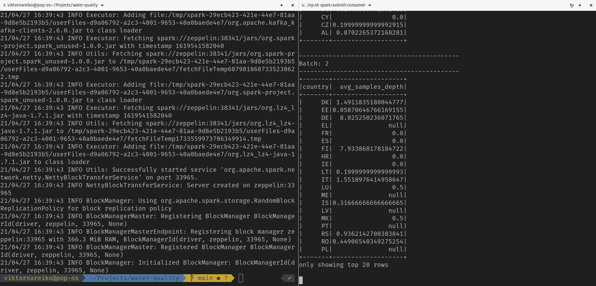
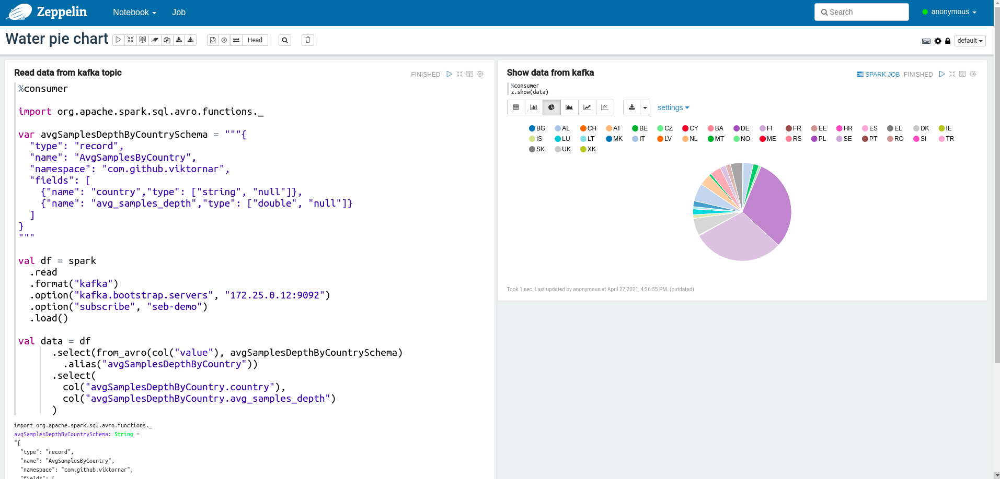

# Water quality analysis
## What this project about

The purpose of this project is to try spark with kafka and zeppelin by implementing POC and application for such steps:
* Set up kafka, spark and zeppelin with docker
* Create a new Kafka topic called: seb-demo
* Read Waterbase_v2018_1_T_WISE4_AggregatedData.csv file in /opt/data/initial with Spark
* Convert cvs file to avro file in /opt/data/target
* Read avro file that was stored in /opt/data/target
* Create structured streaming by following these rules:
  1. Use target file as input
  2. Proceed with data aggregations, data cleansing, or similar to analyse the data by country. 
  3. Publish the analysis results to the Kafka topic seb-demo
* Ensure that streaming pipeline is working
* Write some unit tests

## Requirements

You need to have linux with:
* docker version 20.10.5
* docker-compose version 1.24.1
* java version 11
* sbt version 1.4.9
* scala version 2.12

Set up is not working with MacOS and probably will not work with Windows. In current set up I'm using bridge network set up with imap and in Mac it is not working.
  
## Docker

Spark, kafka, zeppelin are set up with docker compose. For easy set up and automate some repetitive tasks you can use **op.sh** shell script.

```shell
cd [project root]
# Will download containers, set up network and create kafka topic `seb-demo`
./op.sh compose=up
# Will destroy everything
./op.sh compose=down
# Will pause containers
./op.sh compose=stop
# Will wake up containers
./op.sh compose=start
# Display topic in kafka
./op.sh topic=list
# Will create seb-demo topic
./op.sh topic=seb-demo
# Will create kafka producer for testing
./op.sh producer=seb-demo
# Will create kafka consumer for testing
./op.sh producer=seb-demo
# Will submit spark application for reading csv, writing avro, aggregation and publishing to topic 
./op.sh spark=submit-producer
# Will submit spark application for stream from kafka topic and displaying data in ascii table :D
./op.sh spark=submit-consumer
```

Initial data (csv), converted files (avro), zeppelin notebooks are placed in data and mapped respectively:

```yaml
volumes:
  - ./data/.cache:/.cache
  - ./data/.local:/.local
  - ./data/notebook:/opt/zeppelin/notebook
  - ./data/conf:/opt/zeppelin/conf
  - ./data/initial:/opt/data/initial
  - ./data/target:/opt/data/target
  - ./data/work:/opt/data/work
  - spark:/spark
```

Some examples:



## POC

For quick prototyping I have used Zeppelin with Analyses/POC notebook where all basic steps are implemented



## Spark application

Basic aggregation and so on logic also implemented with Spark applications in **src** folder as **WaterQualityProducer.scala** **WaterQualityConsumer.scala**

**WaterQualityProducer.scala** will read csv, convert it to avro, read avro, do some normalization, aggregation and publish to seb-demo topic.

This application can be published by using:
```shell
# Docker must be running with containers
./op.sh spark=submit-producer
```

In **data/work** I have added already compiled application so no need to recompile it, but in case if you need to create a new jar:

```shell
sbt clean package
```

**WaterQualityConsumer.scala** will subscribe to kafka topic **seb-demo** and will display batch as ascii table.

```shell
./op.sh spark=submit-consumer
```

Result of applications:



It is also possible to read kafka stream and display result in pie chart with Zeppelin notebook **Analyses/Water prie chart**



Since I'm not familiar with any of BI tools I just decided to use as BI tools Zeppelin notebook with PI chart that reads data from kafka topic **seb-demo** :D

## Testing strategy
A very nice testing strategy is described in video: https://databricks.com/session/mastering-spark-unit-testing. Tried to follow guidance in this video and wrote some simple tests.

The main idea is to create a spark session with context in tests and run spark locally. For testing, it is also important to have a small amount of data (subset) that can be verified by hand :D. So I took first 19 records from input data and used it in testing.

How to run tests:
```shell
./op.sh compose=up
sbt test
```

## Improvement

* Would be nice to make integration with any BI tools
* Some approaches probably are wrong because of missing knowledge how to work with spark and kafka
* Would be nice to learn how to work with kafka schema, but sake of simplicity in this project I didn't use it
* Probably more space for improvement